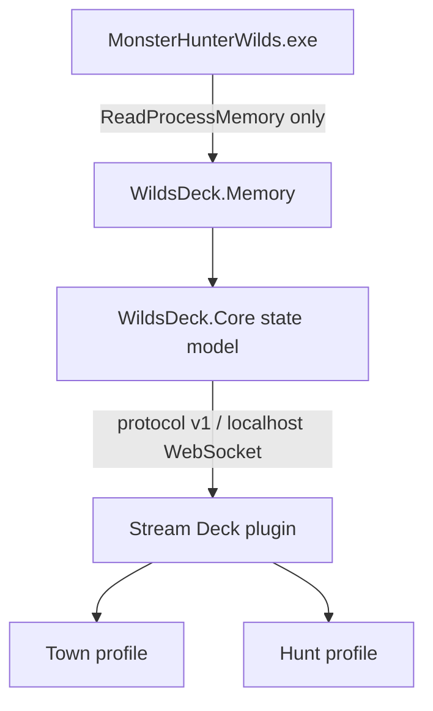

# Architecture

WildsDeck is split into two independently restartable processes.

## Bridge projects

- `WildsDeck.Memory` parses HunterPie-compatible maps, attaches with read-only rights, resolves pointer paths, decrypts Wilds floats, and maps game structures to stable telemetry.
- `WildsDeck.Core` contains the memory-independent state model, JSON settings, calculations, and mode debounce.
- `WildsDeck.Bridge` hosts `ws://127.0.0.1:47653/ws`, the mock/real sources, state pump, connection lifecycle, and console diagnostics.

The real source retries process discovery. It discards a process handle after exit and repeats exact version/map detection on restart. A process, map, or individual optional field failure never terminates the bridge.

## Mode detection

`Game::QuestManager` is the primary source. Both `Quest::Data` and `Quest::CurrentInformation` must resolve; the timer must be finite and valid; and HunterPie's `SuccessState` and `FailureState` must both be zero. No monster/HP heuristic controls the primary mode.

Transitions are published only after the configured stable period (default 1000 ms). `Unknown` samples during loading do not overwrite the last stable mode, preventing profile thrash. When the game disconnects, the published state is `Unknown` and the plugin does not switch.

## Plugin

`Wilds Display` is the only action type. Each key stores `{ metric, displayStyle, label, target }`. A registry resolves that setting against the latest state, and a theme-driven renderer produces SVG. The plugin remembers the last requested profile per device and switches only on a stable mode change or when a newly connected DeviceType `0` needs synchronization.

