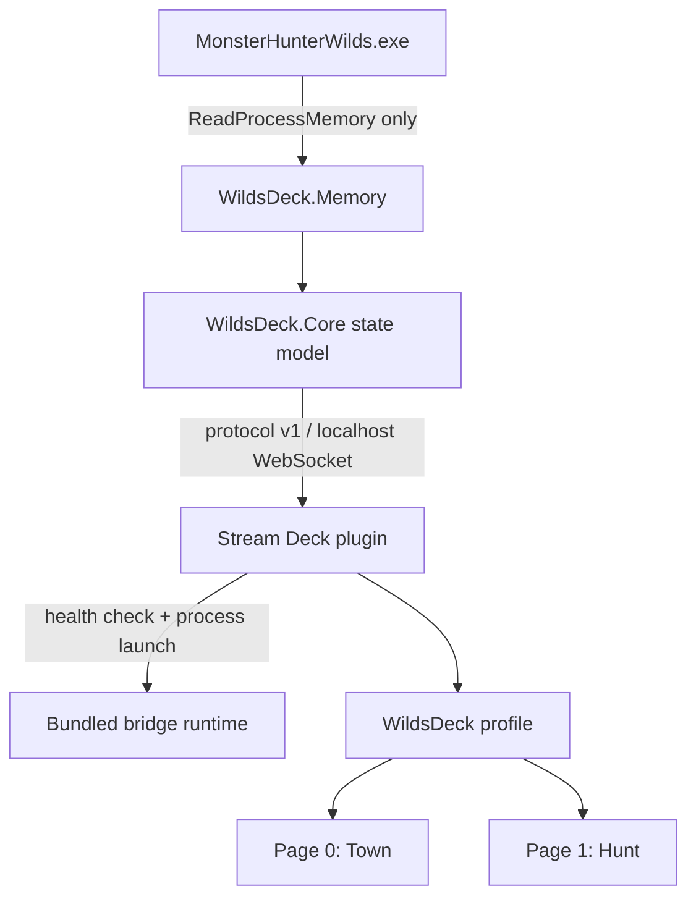

# Architecture

WildsDeck is split into two independently restartable processes.

```mermaid
flowchart TD
    Game["MonsterHunterWilds.exe"] -->|"ReadProcessMemory only"| Memory["WildsDeck.Memory"]
    Memory --> Core["WildsDeck.Core state model"]
    Core -->|"protocol v1 / localhost WebSocket"| Plugin["Stream Deck plugin"]
    Plugin -->|"health check + process launch"| BridgeRuntime["Bundled bridge runtime"]
    Plugin --> Profile["WildsDeck profile"]
    Profile --> Town["Page 0: Town"]
    Profile --> Hunt["Page 1: Hunt"]
```

## Bridge projects

- `WildsDeck.Memory` parses HunterPie-compatible maps, attaches with read-only rights, resolves pointer paths, decrypts Wilds floats, and maps game structures to stable telemetry.
- `WildsDeck.Core` contains the memory-independent state model, JSON settings, calculations, and mode debounce.
- `WildsDeck.Bridge` hosts `ws://127.0.0.1:47653/ws`, the mock/real sources, state pump, connection lifecycle, and console diagnostics.

The real source retries process discovery. It discards a process handle after exit and repeats exact version/map detection on restart. A process, map, or individual optional field failure never terminates the bridge.

The build publishes `WildsDeck.Bridge` as a self-contained Windows x64 runtime inside `com.wildsdeck.streamdeck.sdPlugin/bin/bridge/`, together with `wildsdeck.json` and the address maps. The plugin therefore does not depend on the repository path or an installed .NET runtime after packaging.

When the plugin launches the bridge it supplies `--parent-pid <plugin pid>`. The bridge monitors that parent process and stops when it exits, so Stream Deck reloads and plugin upgrades do not leave stale bridge instances behind.

## Mode detection

`Game::QuestManager` is the primary source. Both `Quest::Data` and `Quest::CurrentInformation` must resolve; the timer must be finite and valid; and HunterPie's `SuccessState` and `FailureState` must both be zero. No monster/HP heuristic controls the primary mode.

Transitions are published only after the configured stable period (default 1000 ms). `Unknown` samples during loading do not overwrite the last stable mode, preventing page thrash. When the game disconnects, the published state is `Unknown` and the plugin does not switch.

## Plugin

`Wilds Display` is the only action type. Each key stores `{ metric, displayStyle, label, target }`. A registry resolves that setting against the latest state, and a theme-driven renderer produces SVG. The plugin remembers the last requested page per device and switches the bundled `WildsDeck` profile to page 0 for Town or page 1 for Hunt only on a stable mode change or when a newly connected DeviceType `0` needs synchronization.

At startup and whenever the WebSocket is disconnected, the plugin checks `http://127.0.0.1:47653/health`. If a healthy WildsDeck bridge is already present it is reused. Otherwise the plugin starts the bundled `WildsDeck.Bridge.exe` hidden, with a short launch cooldown to coalesce simultaneous/repeated reconnect events. The existing WebSocket retry loop then reconnects as soon as the bridge is ready.
